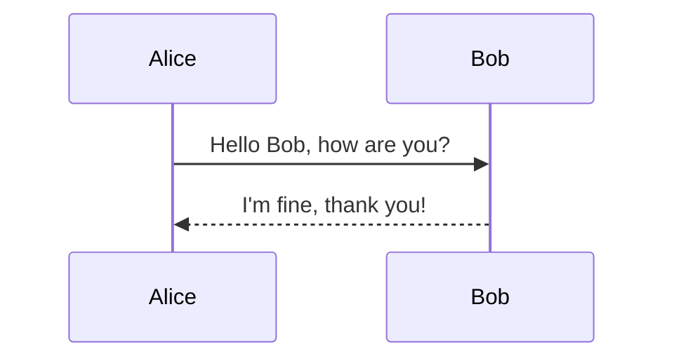
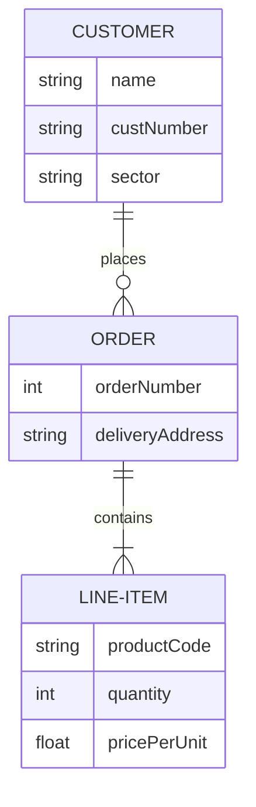

# L8 - Y1 - Database Systems 1

## Mermaid Diagram Test

```mermaid
sequenceDiagram
    Alice->>Bob: Hello Bob, how are you?
    Bob-->>Alice: I'm fine, thank you!
```

```mermaid
erDiagram
    CUSTOMER ||--o{ ORDER : places
    CUSTOMER {
        string name
        string custNumber
        string sector
    }
    ORDER ||--|{ LINE-ITEM : contains
    ORDER {
        int orderNumber
        string deliveryAddress
    }
    LINE-ITEM {
        string productCode
        int quantity
        float pricePerUnit
    }
```