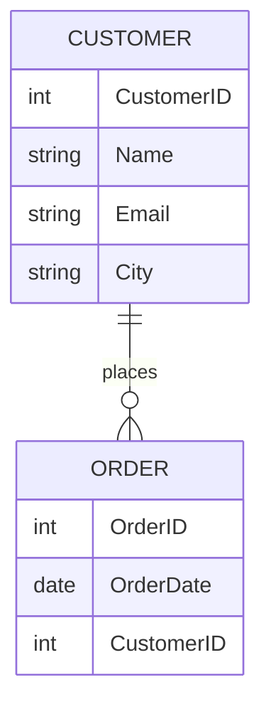
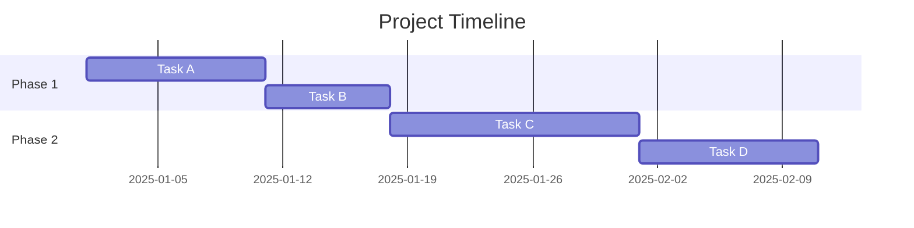
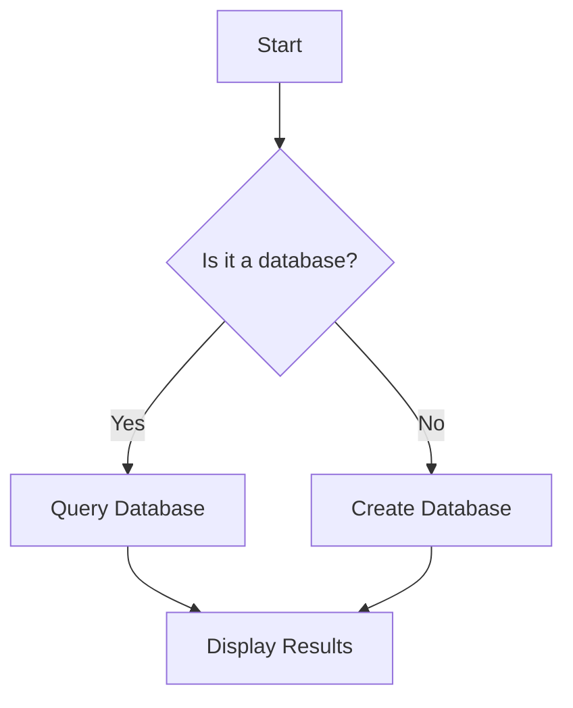
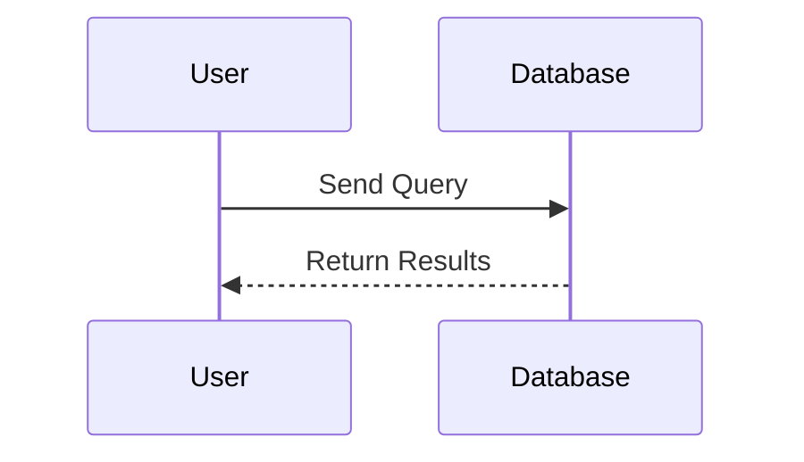

# Slide 1: Introduction to Database Systems

---

## What is a Database System?
- A structured system to store, manage, and retrieve data.
- Relational Database Management System (RDBMS) uses tables to store data.

**Example RDBMS:** MySQL, PostgreSQL, Oracle, SQL Server

---

# Slide 2: Key Concepts of RDBMS

---

## Relational Model
- Data is organized in tables (relations).
- Each table consists of rows (tuples) and columns (attributes).

**Example Table:** Customers

| CustomerID | Name       | Email              | City       |
|------------|------------|--------------------|------------|
| 1          | Alice      | alice@example.com  | New York   |
| 2          | Bob        | bob@example.com    | Los Angeles|
| 3          | Charlie    | charlie@example.com| Chicago    |

---

# Slide 3: SQL Basics

---

## SQL Query Structure

```sql
SELECT column1, column2
FROM table_name
WHERE condition;
```

**Example:** Retrieve customers from New York

```sql
SELECT Name, Email
FROM Customers
WHERE City = 'New York';
```

---

# Slide 4: Database Design Principles

---

## Normalization
- Process of organizing data to reduce redundancy.

**Key Normal Forms:**
- 1NF: Eliminate duplicate columns.
- 2NF: Ensure all non-key attributes depend on the primary key.
- 3NF: Remove transitive dependencies.

---

# Slide 5: ER Diagrams

---



---

# Slide 6: Gantt Chart Example

---



---

# Slide 7: Flowchart Example

---



---

# Slide 8: Sequence Diagram Example

---



---

# Slide 9: Java and Databases

---

## JDBC Example

```java
import java.sql.*;

public class DatabaseExample {
    public static void main(String[] args) {
        String url = "jdbc:mysql://localhost:3306/mydatabase";
        String username = "root";
        String password = "password";

        try (Connection conn = DriverManager.getConnection(url, username, password)) {
            String query = "SELECT * FROM Customers";
            Statement stmt = conn.createStatement();
            ResultSet rs = stmt.executeQuery(query);

            while (rs.next()) {
                System.out.println(rs.getString("Name") + " - " + rs.getString("Email"));
            }
        } catch (SQLException e) {
            e.printStackTrace();
        }
    }
}
```

---

# Slide 10: Summary

---

## Key Takeaways
- Database systems help manage and retrieve data efficiently.
- SQL is the language for querying relational databases.
- ER diagrams help visualize database structure.
- Java can interact with databases using JDBC.

---

## Questions?

---
