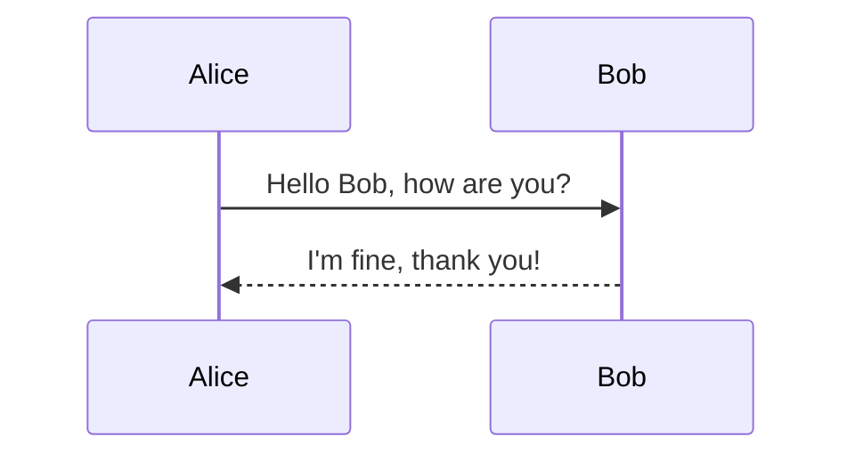

# Slide 1
Your content here.

---

# Slide 2
More content here.

note:
These are the speaker notes for this slide. They will only be visible in the presenter view.

---

# Slide 3

```java
public class HelloWorld {
    public static void main(String[] args) {
        System.out.println("Hello, World!");
    }
}
```

note:
Other are the speaker notes for this slide. They will only be visible in the presenter view.

---

### Slide 4



---

## SQL Code Example

```sql
-- Create a new table
CREATE TABLE employees (
    id INT PRIMARY KEY,
    first_name VARCHAR(50),
    last_name VARCHAR(50),
    hire_date DATE,
    salary DECIMAL(10, 2)
);

-- Insert data into the table
INSERT INTO employees (id, first_name, last_name, hire_date, salary)
VALUES (1, 'Alice', 'Smith', '2023-01-15', 50000.00);

-- Query the table
SELECT id, first_name, last_name, salary
FROM employees
WHERE salary > 40000
ORDER BY salary DESC;
```
